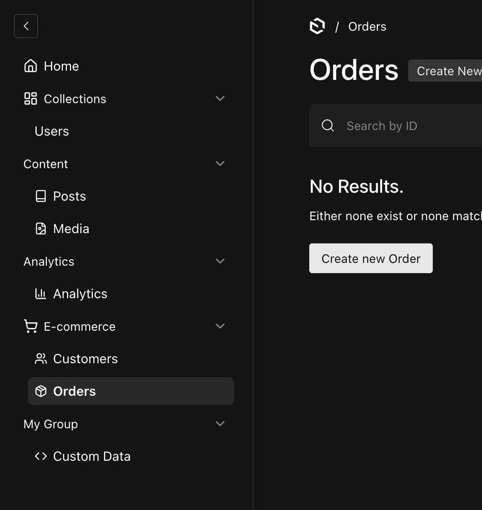

# Payload Advanced Sidebar

A Payload CMS 3.0 plugin that enhances your admin sidebar navigation. It allows you to assign custom icons to your collection/global groups as well as individual items, making your admin interface much more visually appealing and organized.



## Features

- 📁 **Group Icons**: Assign custom icons to the sidebar groups you've defined in your Payload config.
- 🎨 **Item Icons**: Assign custom icons to individual collections and globals.
- ⚡️ **Lucide React Integration**: Uses [Lucide React](https://lucide.dev/) icons by default. Just pass the exact string name of the icon (e.g., `'ShoppingCart'`).
- ⚙️ **Simple Configuration**: Seamlessly integrates with your existing Payload config without needing to rewrite your navigation structure.

## Installation

```bash
npm install payload-advanced-sidebar
# or
yarn add payload-advanced-sidebar
# or
pnpm add payload-advanced-sidebar
```

## Usage

This plugin relies on the standard `admin.group` property you define on your collections and globals in Payload. You simply map those group names or item slugs to an icon!

Add the plugin to your `payload.config.ts`:

```typescript
import { buildConfig } from 'payload/config'
import { advancedSidebarPlugin } from 'payload-advanced-sidebar'

export default buildConfig({
  collections: [
    {
      slug: 'posts',
      admin: { group: 'Content' }, // The group name used below
      fields: [],
    },
    {
      slug: 'customers',
      admin: { group: 'E-commerce' }, // The group name used below
      fields: [],
    }
  ],
  plugins: [
    advancedSidebarPlugin({
      enabled: true, // Optional: defaults to true
      // 1. Configure icons for your navigation groups
      groups: {
        'E-commerce': {
          icon: 'ShoppingCart', // String matching a Lucide React icon
        },
        'Content': {
          icon: 'LayoutDashboard',
        },
      },
      // 2. Configure icons for specific items (by slug)
      items: {
        'posts': {
          icon: 'Book',
        },
        'customers': {
          icon: 'Users',
        },
      },
    }),
  ],
})
```

## Plugin Options

| Option | Type | Default | Description |
| :--- | :--- | :--- | :--- |
| `enabled` | `boolean` | `true` | Set to `false` to easily disable the plugin entirely. |
| `animations` | `boolean` | `true` | Set to `false` to disable smooth expanding/collapsing animations for sidebar groups. |
| `groups` | `Record<string, { icon?: string }>` | `{}` | Map your group names (e.g., `'E-commerce'`) to specific Lucide React icon names. |
| `items` | `Record<string, { icon?: string }>` | `{}` | Map your collection/global slugs (e.g., `'posts'`) to specific Lucide React icon names. |

## Development

To develop or contribute to this plugin:

1. Clone the repository
2. Run `pnpm install`
3. Run `pnpm dev` to start the development server
4. Edit the files in the `src` directory

## License

MIT
